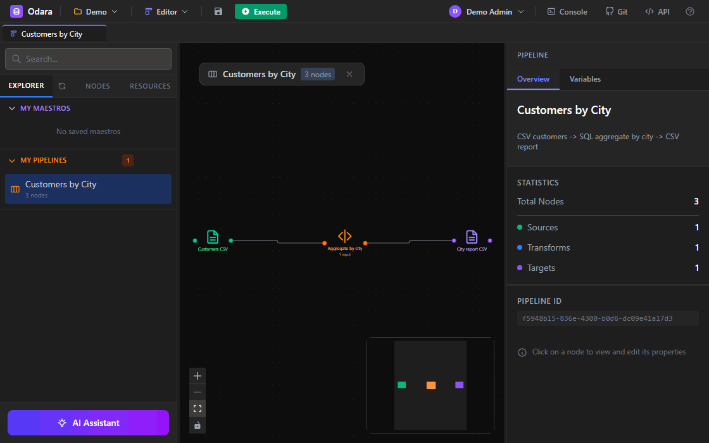
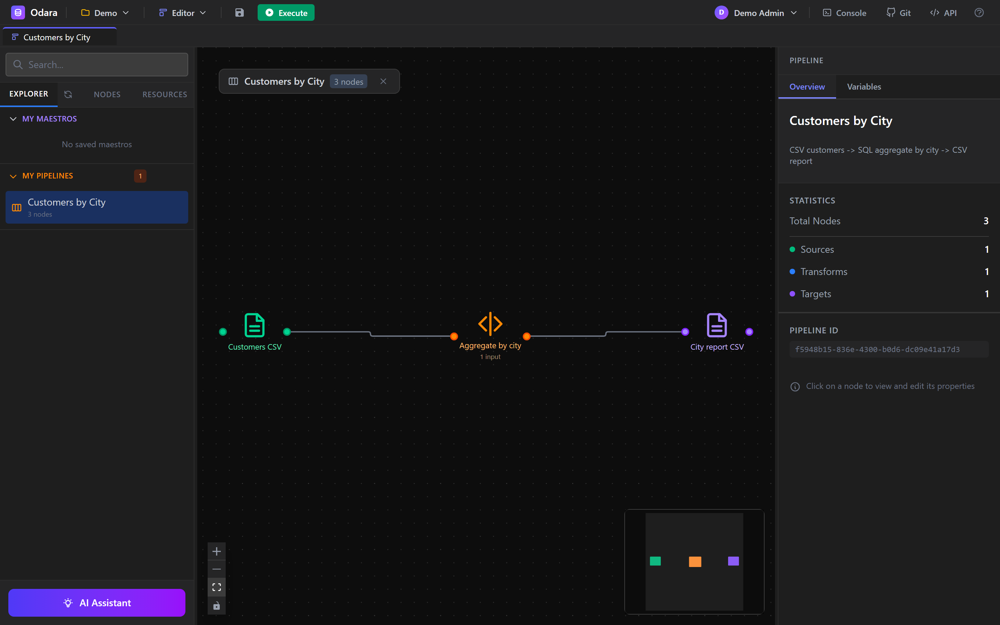
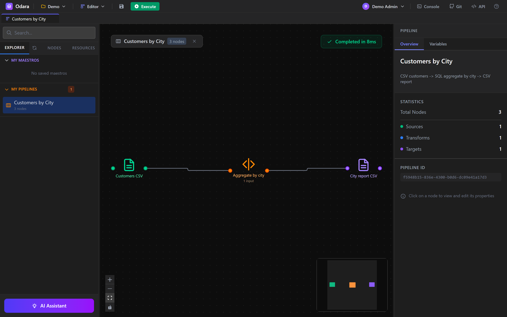
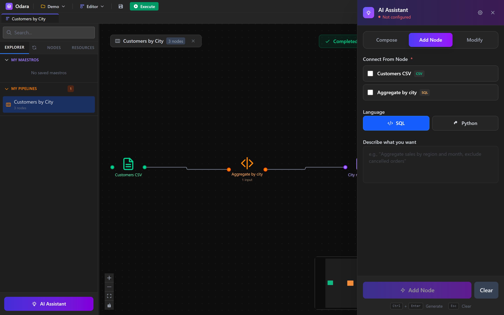

<div align="center">

# Odara

**AI-first ETL that runs on your machine**




[Website](https://odaraetl.com) · [Docs](https://odara.rs) · [Report a bug](https://github.com/odara-etl/odara_community/issues)

</div>

---

## What is Odara

Odara is an ETL/ELT tool you run locally. You build pipelines visually, and you
can drop into **SQL** (DataFusion) or **Python** for any transform that needs
real logic — in the same pipeline. An **AI assistant** is built in to help you
generate SQL, Python, and whole pipelines from a plain-language description.

The engine is written in **Rust** on top of **Apache DataFusion** (Arrow-based),
and the editor is **React**. No server to host, no account to create — download
the binary, run it, open your browser.

## Screenshots

| Visual editor | After a run |
|---|---|
|  |  |

The built-in AI assistant generates SQL or Python nodes from a description:



## Get Started in 5 minutes

1. **Download** the build for your OS from [odaraetl.com](https://odaraetl.com)
   (or [odara.rs](https://odara.rs)).
   - **Windows** — `odara_0.1.0_windows_amd64.zip`
   - **Linux** — `odara_0.1.0_amd64.deb`

2. **Run it**
   - **Windows**: extract the zip, double-click `odara.exe`
   - **Linux**: `sudo dpkg -i odara_0.1.0_amd64.deb` then run `odara`

   Odara starts on port **3002** and opens `http://localhost:3002` in your
   browser automatically.

3. **Log in** with the default admin account created on first launch:

   | Email | Password |
   |-------|----------|
   | `admin@odara.rs` | `odara123` |

   Change the password after first login.

4. **Build your first pipeline**
   - Click **+** to open a new pipeline tab
   - Drag a **CSV Source** onto the canvas and point it at a file
   - Add a **SQL Transform** (or ask the **AI assistant** to write it)
   - Drag a **CSV Target** and connect the nodes
   - Hit **Run** and watch progress stream live

> **Python transforms** are optional. They only require Python 3.9+ with
> `pyarrow` installed (`pip install pyarrow`). Everything else runs without it.

### Command-line options

```bash
odara --port 8080      # use a different port
odara --host 127.0.0.1 # bind to a specific host
```

## Connectors

Sources and targets available today:

**Files** — CSV, Excel, XML, Magic File (auto-detects the format)

**Databases** — PostgreSQL, MySQL, SQL Server, MongoDB, Oracle, Snowflake,
IBM DB2, Generic ODBC

**Cloud storage** — Amazon S3, Google Drive, Azure Blob (list / download /
upload / copy / delete)

**REST** — REST Source (GET with pagination, auth, retry) and REST Target
(POST/PUT/PATCH with batching)

**File transfer** — FTP / SFTP / FTPS (list, get, put, rename, delete)

**Transforms** — SQL (DataFusion), Python (subprocess), Filter, Mapper
(N:M with joins and expressions, tMap-style), Set Variable

**Control flow** — Sleep, RunAfter, Iterate

## Why Odara

- **One tool, two languages.** Visual pipelines when that's enough; SQL or
  Python when you need real logic — mixed freely in the same pipeline.
- **AI that writes the boring parts.** Generate SQL, Python, or a starting
  pipeline from a description, then edit it like any other node.
- **Runs where your data is.** A single local binary. Nothing leaves your
  machine unless your pipeline sends it somewhere.
- **Rust + Arrow under the hood.** Data moves between nodes as Apache Arrow
  record batches; SQL executes natively in DataFusion.

Odara is young (v0.1.0) and not trying to replace your whole stack on day one.
It's a fast, local, scriptable ETL tool with an AI assistant — that's the bet.

## License

Odara is **free** to download and use under the **Community Edition** (up to 3
user accounts per installation).

Odara is **open-core**, **not open source**: this repository is a public
showcase (presentation, docs, downloads). The product source code is
proprietary and lives in a private repository.

---

Questions, bugs, or feature ideas? See [FEEDBACK.md](FEEDBACK.md) or open an
issue. Contact: **info@odara.rs**
